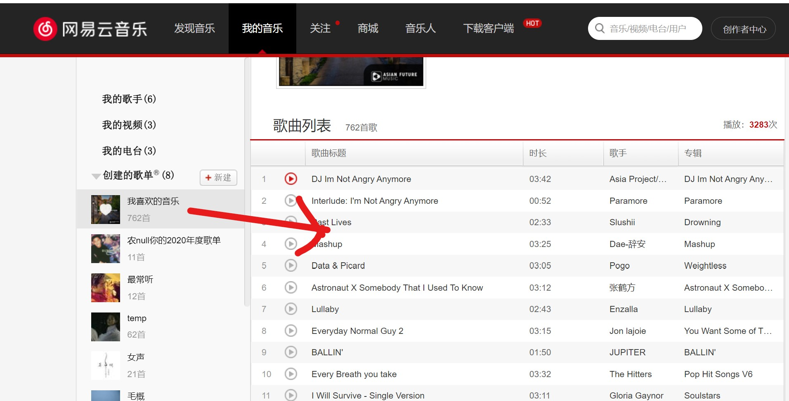
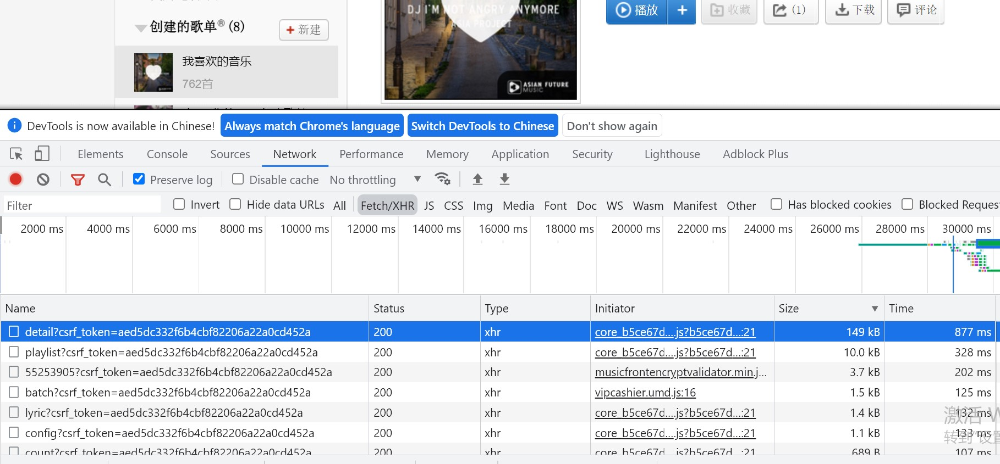
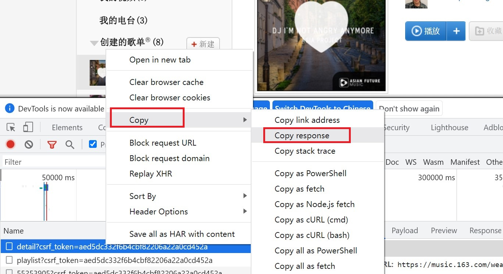
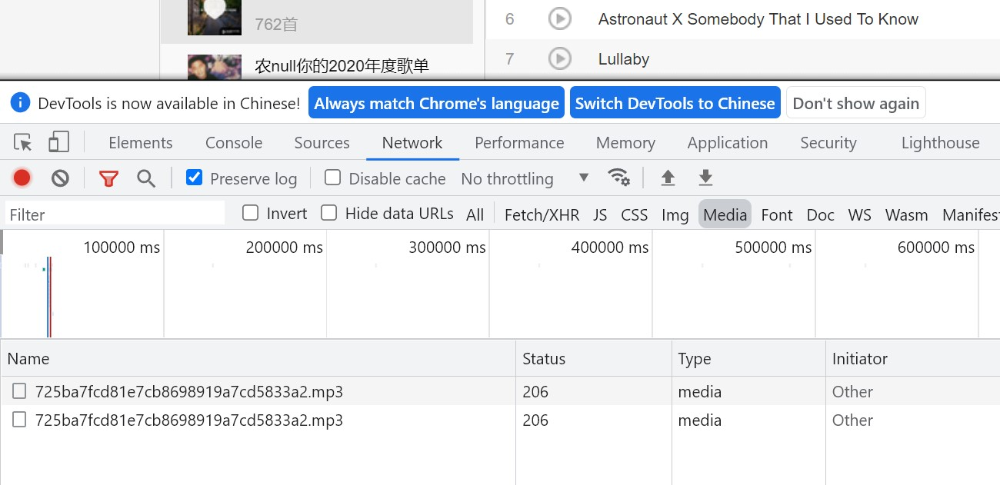

### 介绍
------------------
这是一个支持批量下载网易云音乐的命令行应用程序

#### 运行环境
------------------
电脑需要安装Java 1.6或者以上

#### 用法
------------------
下载编译好的[jar包](./163-music.jar)，或者自行使用maven编译打包本工程。
然后在终端运行命令 `java -jar 163-music.jar 歌单文件`,
下面介绍如何获取歌单文件。

#### 获取歌单文件步骤
------------------
1. 将喜欢的音乐添加到自己的歌单或者收藏别人的歌单
2. 登录网易云音乐，`我的音乐`-->`创建的歌单`-->`点开要下载的歌单`

3. 鼠标右键`检查`打开开发者工具,选择`Network`-->`Fetch/XHR`,
刷新页面，找到`https://music.163.com/weapi/v6/playlist/detail`请求
歌单文件

4. `鼠标右键请求`-->`copy`-->`Copy response`, 将拷贝保存到新文件，命名为
music-list.json（当然可以随便命名）,这个文件就是运行命令行程序所需要的
歌单文件  

5. 运行命令`java -jar 163-music.jar music-list.json`,下载的歌曲会保存到当前目录

#### 特别说明
------------------
有损坏的音乐文件可能的原因是该音乐在网易云已经下架或者是需要vip下载

#### 如果自己是vip用户，这里提供一种手动下载歌曲的方法
-----------------------
打开开发者工具，选择`Network`->`Media`,点击播放音乐，可以文件列表中看到音乐文件，
将这个文件下载保存即可

